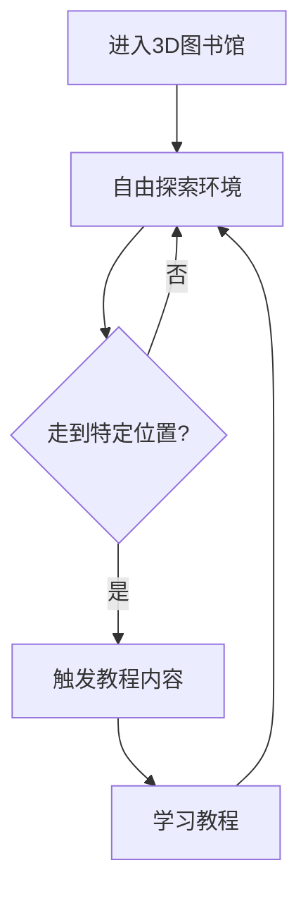

## 1. Product Overview
3D图书馆教程场景，将传统教程网页转化为交互式3D图书馆环境，用户可在其中自由探索学习。
- 主要目的是提供沉浸式学习体验，通过空间导航增强学习趣味性和记忆效果
- 目标用户为需要学习教程内容的学习者，尤其是喜欢视觉化和交互式学习的用户

## 2. Core Features

### 2.1 User Roles
| 角色 | 注册方式 | 核心权限 |
|------|---------|----------|
| 普通用户 | 无需注册 | 浏览3D图书馆、访问教程内容、自由导航 |

### 2.2 Feature Module
1. **3D图书馆场景**：图书馆环境渲染、用户导航控制、教程内容触发
2. **教程内容系统**：内容展示、位置关联、进度追踪
3. **用户交互系统**：视角控制、移动控制、热点交互

### 2.3 Page Details
| 页面名称 | 模块名称 | 功能描述 |
|---------|---------|----------|
| 3D图书馆场景 | 环境渲染 | 渲染古色古香的图书馆环境，包括书架、绿植、休息区等元素 |
| 3D图书馆场景 | 用户导航 | 支持用户在图书馆内自由移动，包括行走、转向等操作 |
| 3D图书馆场景 | 教程触发 | 当用户走到特定位置时，自动触发相关教程内容的展示 |
| 教程内容系统 | 内容展示 | 以弹窗或面板形式展示教程内容，支持文本、图片、视频等多种形式 |
| 教程内容系统 | 位置关联 | 将教程内容与图书馆内特定位置关联，实现空间化学习体验 |
| 用户交互系统 | 视角控制 | 支持鼠标/触摸控制视角，提供第一人称和第三人称视角切换 |
| 用户交互系统 | 热点交互 | 在图书馆内设置热点区域，用户接近时显示提示并触发教程内容 |

## 3. Core Process
用户进入3D图书馆场景 → 自由探索图书馆环境 → 走到特定位置触发教程内容 → 学习教程内容 → 继续探索其他区域

## 4. User Interface Design
### 4.1 Design Style
- 主色调：暖棕色(#8B4513)和米白色(#F5F5DC)，营造古色古香的图书馆氛围
- 辅助色：深绿色(#2F4F2F)用于绿植元素，金色(#DAA520)用于装饰元素
- 按钮风格：木质质感，轻微3D效果，圆角设计
- 字体：正文使用无衬线字体，标题使用衬线字体，增强古典感
- 布局风格：开放式空间布局，以书架和阅读区为中心
- 图标风格：简约线条风格，与整体古典氛围协调

### 4.2 Page Design Overview
| 页面名称 | 模块名称 | UI元素 |
|---------|---------|--------|
| 3D图书馆场景 | 环境渲染 | 木质书架、舒适的座椅、绿植装饰、温暖的灯光效果、古籍装饰 |
| 3D图书馆场景 | 用户导航 | 第一人称视角，流畅的移动动画，碰撞检测避免穿墙 |
| 3D图书馆场景 | 教程触发 | 半透明提示框，柔和的动画过渡，内容面板优雅弹出 |
| 教程内容系统 | 内容展示 | 半透明背景面板，清晰的文本排版，响应式布局 |
| 用户交互系统 | 视角控制 | 平滑的视角转换，鼠标/触摸手势支持，视角限制防止过度旋转 |
| 用户交互系统 | 热点交互 | 微妙的粒子效果标记热点，接近时的视觉反馈 |

### 4.3 Responsiveness
- 桌面优先设计，支持鼠标和键盘控制
- 移动设备适配，支持触摸控制和手势操作
- 自适应窗口大小，保持3D场景的正确比例

### 4.4 3D Scene Guidance
- 环境/HDRI：温暖的室内环境光，柔和的阴影效果
- 光照设置：混合使用环境光和定向光，模拟真实图书馆的光照效果
- 相机设置：第一人称相机，支持自由视角调整，适当的视野范围
- 构图和焦点元素：以书架和阅读区为焦点，引导用户注意力
- 交互和动画：流畅的移动动画，微妙的环境动画（如微风轻拂书页）
- 后处理效果：轻微的景深效果，增强真实感
- 资产来源：使用高质量的3D模型和纹理，优化性能确保流畅运行