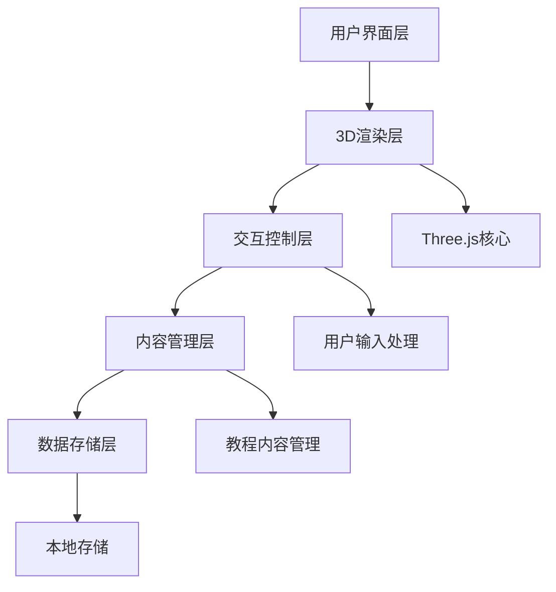

## 1. Architecture Design


## 2. Technology Description
- 前端：React@18 + TypeScript + TailwindCSS + Vite
- 3D渲染：Three.js + @react-three/fiber + @react-three/drei + @react-three/postprocessing
- 状态管理：Zustand
- 本地存储：localStorage (用于保存学习进度)
- 构建工具：Vite

## 3. Route Definitions
| 路由 | 用途 |
|------|------|
| / | 3D图书馆主场景 |
| /about | 关于页面 |
| /help | 帮助页面 |

## 4. 核心模块设计

### 4.1 3D场景模块
- 场景初始化：创建Three.js场景、相机、渲染器
- 环境构建：加载3D模型、纹理和材质
- 光照系统：设置环境光和定向光
- 后处理效果：添加景深、 bloom 等效果

### 4.2 导航控制模块
- 第一人称控制器：实现WASD/箭头键移动，鼠标控制视角
- 碰撞检测：防止用户穿过墙壁和物体
- 移动平滑：添加加速度和减速度，使移动更自然

### 4.3 教程内容模块
- 内容管理：组织教程内容数据结构
- 位置关联：将教程内容与3D场景中的特定位置关联
- 触发系统：检测用户位置，触发相应的教程内容
- 内容展示：设计教程内容的UI展示

### 4.4 交互系统模块
- 热点检测：检测用户与热点区域的交互
- 手势控制：支持鼠标和触摸设备的交互
- 状态管理：管理用户状态和场景状态

## 5. 数据结构设计

### 5.1 教程内容数据结构
```typescript
interface TutorialContent {
  id: string;
  title: string;
  content: string;
  position: { x: number; y: number; z: number };
  radius: number; // 触发半径
  type: 'text' | 'image' | 'video';
  mediaUrl?: string; // 图片或视频URL
}
```

### 5.2 用户状态数据结构
```typescript
interface UserState {
  position: { x: number; y: number; z: number };
  rotation: { x: number; y: number; z: number };
  completedTutorials: string[];
  currentTutorial: string | null;
}
```

## 6. 性能优化策略
- 3D模型优化：使用低多边形模型，合理设置LOD
- 纹理优化：压缩纹理，使用适当的纹理格式
- 渲染优化：使用frustum culling，合理设置渲染距离
- 动画优化：使用requestAnimationFrame，避免不必要的重绘
- 资源加载：使用预加载和懒加载策略

## 7. 实现路径
1. 初始化React + Three.js项目
2. 构建基础3D场景和环境
3. 实现用户导航控制
4. 设计并实现教程内容系统
5. 集成热点交互功能
6. 优化性能和用户体验
7. 测试和调试

## 8. 部署策略
- 静态网站部署：使用GitHub Pages或Vercel
- 资源管理：合理组织静态资源，使用CDN加速
- 构建优化：使用Vite的生产构建，优化资源大小